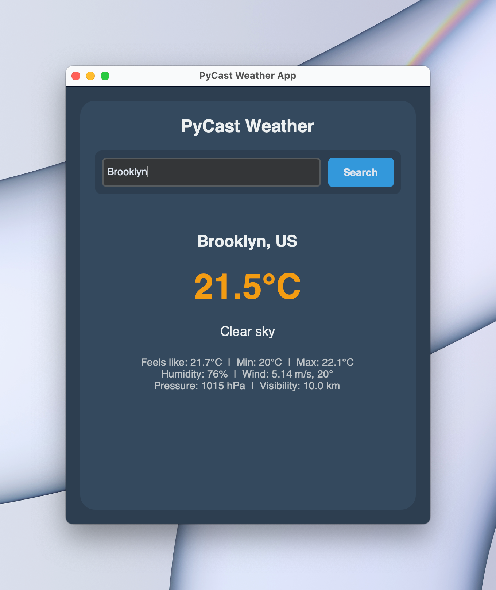

# PyCast Weather App

PyCast is a simple, sleek, user-friendly weather app built using Python and the CustomTkinter library. It fetches current weather data for any city using the OpenWeather API and displays it in a modern graphical interface.

## Features

- Fetches current weather for any city in real-time
- Displays temperature, weather conditions, wind speed, humidity, and more
- Clean and modern UI design
- Easy to use

## Screenshots



## Installation

### Prerequisites

1. **Python 3.x**: Make sure you have Python 3.x installed on your system. You can download it from [here](https://www.python.org/downloads/).
2. **Pip**: Ensure you have `pip` installed to manage dependencies.

### Step-by-Step Setup

1. Clone the repository or download the source code:
    ```bash
    git clone https://github.com/yourusername/pycast-weather-app.git
    cd pycast-weather-app
    ```

2. Install the required dependencies:
    ```bash
    pip install -r requirements.txt
    ```

3. Sign up for an OpenWeather API key from the [OpenWeather website](https://openweathermap.org/api).

4. Create a `secret.env` file in the root directory of the project with the following content:
    ```
    OPEN_WEATHER_API_KEY = "your_openweather_api_key"
    ```
   **For this tech assessment I left in my api key so you can use it for free, but in reality I would not commit the secret api key.**

5. Run the app:
    ```bash
    python3 main.py
    ```

## Usage

1. Launch the application by running `python3 main.py`.
2. Enter the name of a city in the input box.
3. Click the **Search** button to fetch and display the current weather data for the city.